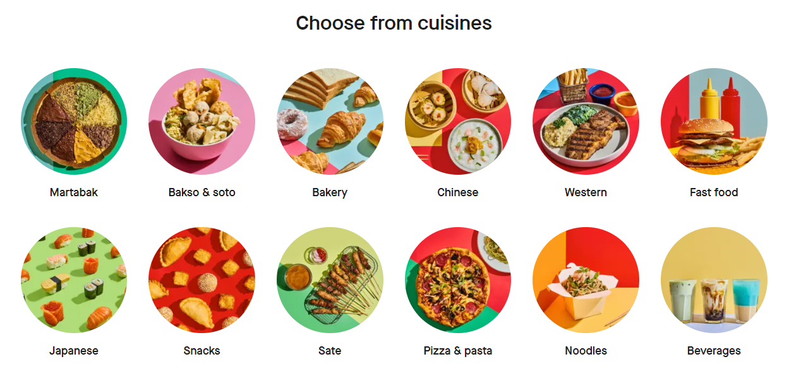

# GoFood Scrapper
Scrapper to get restaurant and menu information from GoFood website

## How To Run
* Install all requirements listed in requirements.txt using python virtual environment
    ```
    pip install -r requirements.txt
    ```
* Go to the [GoFood website](https://gofood.co.id/en) then choose the location and cuisine type

* Copy the HTML link in the browser, e.g. https://gofood.co.id/en/jakarta/restaurants/burger_sandwich_steak
* Get all listed restaurant metadata by running this code in terminal, you should see the data in the `data/restaurant_metadata.csv` path
    ```
    python main.py -gr https://gofood.co.id/en/jakarta/restaurants/burger_sandwich_steak
    ```
* Get all menu metadata from each restaurant by running this code in terminal, you should see the data in the `data/menu_metadata.csv` path
    ```
    python main.py -gmd
    ```

## Data Format Explanation
* Restaurant Metadata:
    * *id*: Unique ID indicating the restaurant record
    * *name*: Name of the restaurant
    * *category*: Restaurant's food categories
    * *price*: Price level of the restaurant, lower price level means cheaper price
    * *link*: Link to the restaurant page in GoFood
* Menu Metadata:
    * *id*: Unique ID indicating the menu record
    * *resto_id*: Restaurant ID reference, can be seen in the `data/restaurant_metadata.csv` on *id* column
    * *section*: The section of which menu is categorized
    * *menu_name*: Name of the menu
    * *menu_detail*: Menu detail explanation, filled with empty string if the menu did not contains description
    * *price*: The price of the menu (in Indonesian Rupiah)